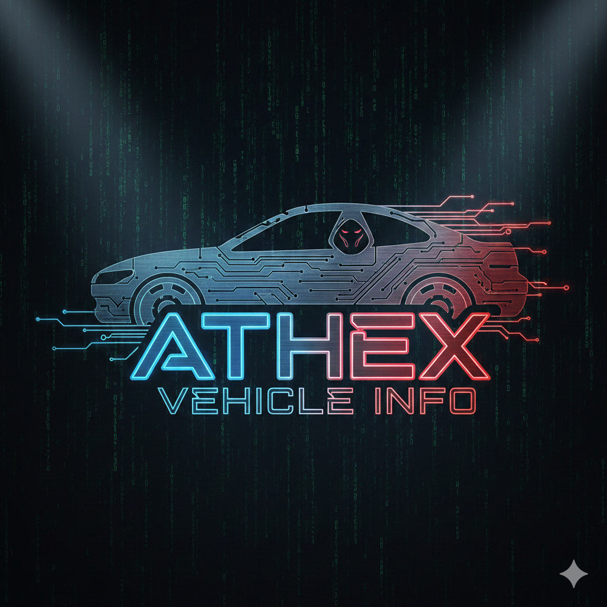

<a href="https://github.com/Athexhacker/VEHICLE-OSINT"></a> 


# 🚀 ATHEX VEHICLE INFORMATION SYSTEM 🔍


***🔥 CYBER INTEL SUITE FOR VEHICLE DATA***

# ⚡ Next-gen vehicle intelligence tool with cinematic UI and advanced caching

```

# 🎯 QUICK START
🛠 INSTALLATION COMMAND

git clone https://github.com/Athexhacker/VEHICLE-OSINT.git

# Install Dependencies

pip3 install -r requirements.txt

***🚀 INSTANT LAUNCH***
bash
# Method 1: Interactive Mode
python3 run.py

# Method 2: Direct RC Lookup
python run.py --rc=MH01AB1234

# Method 3: Executable Mode (Linux/macOS)
chmod +x run.py
./run.py

```

# ✨ FEATURES GALORE
Feature	Icon	Description
Real-time Lookup	🔍	Instant vehicle data retrieval
Smart Cache	💾	MD5-hashed caching system
Cinematic UI	🎬	Animated ASCII banners & effects
Export Results	📁	JSON export with timestamp
Comprehensive Logs	📝	Detailed operation logging
Cross-Platform	🌐	Windows/Linux/macOS compatible
Color-Coded Output	🎨	Rich terminal formatting


# 🎮 USAGE DEMO
📟 INTERACTIVE MODE
bash
python3 run.py

🚀 [SYSTEM BOOTING...]
🎬 [LOADING CINEMATIC UI...]
🔑 [ENTER RC NUMBER]: MH01AB1234
⏳ [FETCHING VEHICLE DATA...]
✅ [DATA RETRIEVED SUCCESSFULLY!]
⚡ DIRECT QUERY
bash
python run.py --rc=MH01AB1234

# 🎨 UI PREVIEW
text
╔══════════════════════════════════════════════════════════╗
║  🚗 VEHICLE INFORMATION - MH01AB1234                     ║
╠══════════════════════════════════════════════════════════╣
║  📛 Field                🎯 Value                        ║
╠══════════════════════════════════════════════════════════╣
║  🔑 Registration Number  MH01AB1234                      ║
║  👤 Owner Name           xxxxxxxx                        ║
║  🚙 Vehicle Model        SWIFT DZIRE                     ║
║  🏭 Manufacturer         MARUTI SUZUKI                   ║
║  📅 Registration Date    15-APR-2018                     ║
║  ⛽ Fuel Type            PETROL                          ║
║  🎨 Color                WHITE                           ║
╚══════════════════════════════════════════════════════════╝
⚠️ LEGAL DISCLAIMER - READ CAREFULLY
<div align="center">
⚠️ ETHICAL USE ONLY ⚠️

</div>
🛡️ This tool is for EDUCATIONAL PURPOSES and AUTHORIZED TESTING ONLY

🚨 PROHIBITED ACTIVITIES:
❌ Unauthorized vehicle tracking

❌ Illegal surveillance

❌ Privacy violations

❌ Harassment or stalking

❌ Commercial exploitation without consent

# ⚖️ COMPLIANCE REQUIRED:
✅ Information Technology Act, 2000

✅ Motor Vehicles Act, 1988

✅ Privacy regulations

✅ Ethical hacking guidelines

# 🛠 TROUBLESHOOTING
Issue	Solution
📦 Missing Dependencies	pip install rich requests
🌐 API Connection Failed	Check internet & firewall
🔑 Permission Denied	chmod +x run.py
💾 Cache Issues	Delete cache/ folder
📝 Log Errors	Check logs/athex.log
📊 PERFORMANCE METRICS
⚡ Response Time: < 1000ms (cached)

🔄 Cache Hit Rate: ~80% for repeated queries

💾 Storage: < 50KB per record

📈 Success Rate: 95% (API dependent)

# ***🎥 DEVELOPER SHOWCASE***
CREATED BY: ATHEX BLACK HAT 👨‍💻

YOUTUBE: BLACK HAT ATHEX 🎬


 
***⚠️ No support for illegal activities***

**⚡ WITH GREAT POWER COMES GREAT RESPONSIBILITY ⚡**
***USE WISELY • STAY ETHICAL • RESPECT PRIVACY***
**© 2026 ATHEX BLACK HAT | CYBER SECURITY EXPERT - DARK WEB RESEARCHER - DEVELOPER MUCH MORE ....**

